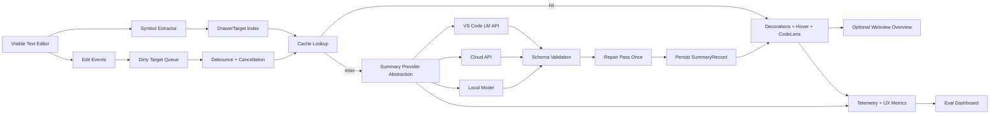
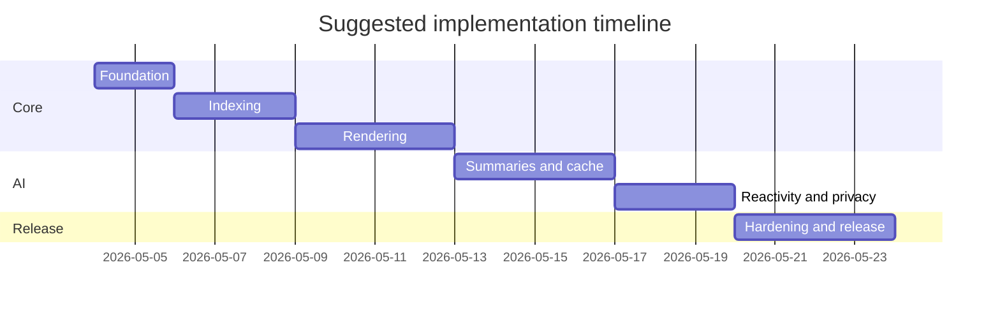

# Semantic Fold Mode for VS Code

## Executive summary

“Semantic Fold Mode” is technically feasible as a conventional VS Code extension, and the best MVP does **not** start by writing a custom parser or custom editor. It should begin by reusing the editor’s existing symbol and folding infrastructure, then layering a lightweight rendering system on top: **existing document symbols for target detection, existing folding ranges for drawer behavior, text decorations for the compact virtual header, and CodeLens for actions** such as Regenerate, Pin, and Promote to Comment. A webview should be treated as an optional secondary surface for overview or diagnostics, not the primary UI, because VS Code explicitly recommends using webviews sparingly and notes that they are resource-heavy. citeturn22view0turn22view1turn2view3turn4view0turn24view0turn25view2

There is clear adjacent prior art. entity["company","JetBrains","software company"] IDEs already expose “Collapse to Definitions” and AI Assistant “Insights,” which is very close to the proposed combination of lexical folding plus semantic captions. entity["company","Sourcegraph","developer tools company"] Cody and entity["company","Tabnine","ai coding tools company"] documentation agents show that in-IDE explanation and documentation generation are already accepted workflows. The paper *Natural Language Outlines for Code* argues that concise natural-language outlines can accelerate code understanding and navigation, which is almost exactly the product thesis behind drawer summaries. citeturn16search0turn16search3turn17view2turn18view0turn14search0

The key architectural recommendation is to make the extension **parser-agnostic and provider-agnostic**. For syntax structure, use `vscode.executeDocumentSymbolProvider` and `vscode.executeFoldingRangeProvider` first, then fall back to Tree-sitter only where provider quality is missing or inconsistent. For summaries, define a single `SummaryProvider` abstraction with three backends: VS Code’s native Language Model API, external cloud APIs, and local models such as those run through entity["company","Ollama","local llm platform"]. This keeps the product viable across privacy regimes, budget tiers, and team policies. citeturn22view0turn22view1turn13search0turn36view0turn25view0turn19search3turn33search3

The most important engineering risks are not folding or UI; they are **staleness, latency, cache invalidation, malformed model output, and privacy boundaries**. Those risks are manageable with a stale-while-revalidate cache keyed by code hashes and prompt/model versions, aggressive cancellation and debounce on edits, strict JSON schema validation with one repair pass, and a default trust posture that disables remote summarization in untrusted workspaces unless a user opts in. VS Code’s Workspace Trust, SecretStorage, telemetry APIs, and Language Model API are sufficient to implement those controls cleanly. citeturn12view0turn12view2turn6search19turn8view0turn10view0turn26view0

The request leaves several constraints unspecified: **target languages, preferred model provider, whether browser/web-extension support is required, whether filesystem indexing beyond the open file is allowed, and whether enterprise/offline operation is mandatory**. The report therefore recommends a desktop-first extension, a parser/provider abstraction layer, and a staged rollout that proves the UX on a narrow language set before expanding.

## Product shape and API choices

The product should feel like a native augmentation of the existing editor, not a replacement editor. Concretely, “drawer” semantics map to folding, while “virtual header” semantics map to decorations and hover text. `DocumentSymbol.range` gives the full symbol extent, `DocumentSymbol.selectionRange` gives the identifier/signature anchor, and `FoldingRange` is line-based, which is exactly what you need for the collapsed drawer body. That means the extension can separate concerns cleanly: line-based folding for concealment, column-accurate decorations for semantic captions. citeturn2view3turn3view2

The first implementation should **query** existing providers instead of immediately **registering** new ones. VS Code exposes built-in commands to execute document-symbol and folding-range providers. That lets Semantic Fold Mode piggyback on mature language support already installed in the user’s environment. A custom `FoldingRangeProvider` should only be introduced after you know where built-in providers fail, because folding providers are merged and overlapping ranges have deterministic conflict rules: if multiple ranges start on the same line, the earliest-registered provider wins, and certain overlaps are discarded. citeturn22view0turn22view1turn3view0

Decorations are the right mechanism for one-line summary text. `DecorationRenderOptions.before` and `.after` can inject text around decorated content, and `DecorationOptions.hoverMessage` can expose the expanded explanation without opening a second UI surface. One important implementation detail from the API is that decoration ranges must **not** be empty, so the summary anchor should decorate at least one character on the signature line and attach the summary using `before`. Also note VS Code’s explicit performance guidance: decoration-specific options should be kept small, and shared decoration types should be preferred over highly customized per-function decorations. citeturn4view0turn4view1turn4view2

CodeLens should be used for actions, not as the primary summary renderer. The API describes CodeLens as commands shown alongside source text, and it explicitly recommends a two-stage design where lenses are produced quickly and resolved lazily for visible ranges. That fits actions such as Regenerate Summary, Show Hover Details, Explain Calls, or Promote to Doc Comment, but it is a poor fit for always-on prose. citeturn24view0turn24view1turn24view2turn24view3

Webviews are optional and should serve a secondary function: a side panel that lists all drawer targets in the current file, shows cache/model status, and optionally previews prompt and output for debugging or evaluation. VS Code’s docs explicitly say webviews should be used sparingly, are resource-heavy, and should be chosen only when the native extension surface is inadequate. If you do use one, prefer a `WebviewViewProvider` in the side bar, persist state with `getState`/`setState`, and only use full panel serialization if restart restoration matters. citeturn25view0turn25view1turn25view2turn25view3



A minimal extraction path looks like this:

```ts
import * as vscode from 'vscode';

export async function collectDrawerTargets(doc: vscode.TextDocument) {
  const [symbols, folds] = await Promise.all([
    vscode.commands.executeCommand<(vscode.DocumentSymbol | vscode.SymbolInformation)[]>(
      'vscode.executeDocumentSymbolProvider',
      doc.uri
    ),
    vscode.commands.executeCommand<vscode.FoldingRange[]>(
      'vscode.executeFoldingRangeProvider',
      doc.uri
    )
  ]);

  const documentSymbols = (symbols ?? []).filter(
    (s): s is vscode.DocumentSymbol => s instanceof vscode.DocumentSymbol
  );

  return flattenSymbols(documentSymbols).map(sym => ({
    id: `${doc.uri.toString()}#${sym.name}:${sym.selectionRange.start.line}`,
    uri: doc.uri.toString(),
    languageId: doc.languageId,
    name: sym.name,
    detail: sym.detail,
    kind: sym.kind,
    fullRange: sym.range,
    selectionRange: sym.selectionRange,
    fold:
      folds?.find(
        f =>
          f.start <= sym.selectionRange.start.line &&
          f.end >= sym.range.end.line - 1
      ) ?? new vscode.FoldingRange(sym.selectionRange.start.line, sym.range.end.line - 1)
  }));
}

function flattenSymbols(list: vscode.DocumentSymbol[], path: string[] = []): vscode.DocumentSymbol[] {
  const out: vscode.DocumentSymbol[] = [];
  for (const item of list) {
    out.push(item);
    out.push(...flattenSymbols(item.children, [...path, item.name]));
  }
  return out;
}
```

For rendering, decorations should be kept shared and light:

```ts
const headerDecoration = vscode.window.createTextEditorDecorationType({
  rangeBehavior: vscode.DecorationRangeBehavior.ClosedClosed,
  before: {
    margin: '0 1ch 0 0',
    color: new vscode.ThemeColor('descriptionForeground')
  }
});

export function applyVirtualHeaders(
  editor: vscode.TextEditor,
  items: Array<{ line: number; text: string; hover: string }>
) {
  const decos: vscode.DecorationOptions[] = [];

  for (const item of items) {
    const line = editor.document.lineAt(item.line);
    const col = line.firstNonWhitespaceCharacterIndex;
    const endCol = Math.min(col + 1, Math.max(col + 1, line.text.length));

    decos.push({
      range: new vscode.Range(item.line, col, item.line, endCol),
      hoverMessage: new vscode.MarkdownString(item.hover),
      renderOptions: {
        before: { contentText: `⟪ ${item.text} ⟫` }
      }
    });
  }

  editor.setDecorations(headerDecoration, decos);
}
```

## Data model and runtime pipeline

A good data model separates **syntax identity**, **summary identity**, and **render state**. The extension needs one immutable-ish record for the symbol target, one cached record for the generated summary, and one ephemeral record for inflight work and editor decoration state. VS Code gives you the right persistence primitives for this split: `workspaceState` and `storageUri` for workspace-local state, `globalState` and `globalStorageUri` for cross-workspace state, and `SecretStorage` for provider credentials. `workspace.fs` works across local and remote file systems, which matters if the extension is used in remote development. citeturn23view1turn23view2turn29view0turn29view1turn29view2turn29view3turn6search19

```ts
type Hash = string;

interface DrawerTarget {
  id: string;                        // stable per symbol anchor
  uri: string;
  languageId: string;
  symbolPath: string[];              // e.g. ["UserService", "buildIndex"]
  kind: number;                      // vscode.SymbolKind
  name: string;
  detail?: string;                   // often contains signature text
  fullRange: { sl: number; sc: number; el: number; ec: number };
  selectionRange: { sl: number; sc: number; el: number; ec: number };
  fold: { startLine: number; endLine: number };
  parser: 'documentSymbol' | 'treeSitter' | 'regex';
  staticCalls?: string[];
  lastSeenDocumentVersion: number;
}

interface SummaryJson {
  headline: string;                  // one-line drawer text
  purpose: string;                   // hover body opener
  methods_used: string[];
  techniques: string[];
  risks: string[];
  confidence: 'low' | 'medium' | 'high';
}

interface SummaryRecord {
  cacheKey: Hash;
  targetId: string;
  semanticHash: Hash;
  sourceHash: Hash;
  promptVersion: string;
  schemaVersion: string;
  providerId: string;                // vscode-lm:gpt-4o-mini, openai:gpt-4.1-mini, local:ollama:qwen2.5-coder
  summary: SummaryJson;
  generatedAt: string;
  latencyMs: number;
  tokensIn?: number;
  tokensOut?: number;
}

interface InflightState {
  targetId: string;
  startedAt: number;
  cancel: vscode.CancellationTokenSource;
}
```

The recommended hashing strategy is two-layered. Use a **source hash** for exact staleness and a **semantic hash** for reuse across formatting-only edits. In practice:

- `sourceHash = sha256(normalizeLF(exactSymbolSlice))`
- `semanticHash = sha256(normalizeLF(stripCommentsAndExtraWhitespace(exactSymbolSlice, languageId)))`
- `cacheKey = sha256([semanticHash, providerId, promptVersion, schemaVersion, settingsProfile].join('\x1f'))`

This lets you be conservative on invalidation while still squeezing real cache hits out of format-on-save, comment-only edits, and whitespace churn. The exact symbol slice should be bounded by `DocumentSymbol.range`, not the full file, so one edit only invalidates the affected drawer. Store `SummaryRecord` JSON blobs under `storageUri` when a workspace exists, and fall back to `globalStorageUri` for loose files. Keep only a tiny LRU index in `workspaceState`/`globalState`; use files for the heavy payloads because `Memento` values must be JSON-stringifyable and are better suited to metadata than larger caches. citeturn2view3turn29view0turn29view1turn29view3

```ts
import { createHash } from 'node:crypto';

function sha256(text: string): string {
  return createHash('sha256').update(text).digest('hex');
}

function normalizeLF(text: string): string {
  return text.replace(/\r\n/g, '\n');
}

export function buildCacheIdentity(args: {
  sourceSlice: string;
  semanticSlice: string;
  providerId: string;
  promptVersion: string;
  schemaVersion: string;
  settingsProfile: string;
}) {
  const sourceHash = sha256(normalizeLF(args.sourceSlice));
  const semanticHash = sha256(normalizeLF(args.semanticSlice));
  const cacheKey = sha256(
    [semanticHash, args.providerId, args.promptVersion, args.schemaVersion, args.settingsProfile].join('\x1f')
  );
  return { sourceHash, semanticHash, cacheKey };
}
```

Edit handling should be incremental and cancel-heavy. VS Code emits `onDidChangeTextDocument`, and `TextDocumentChangeEvent` includes the changed ranges and texts. The extension should map each content change to intersecting `DrawerTarget.fullRange` entries, mark only those targets dirty, and cancel any inflight summarization for those targets. A sensible default is a **500 ms idle debounce** for ordinary typing, a **1000 ms debounce** after large paste/format events, and immediate refresh on save only for still-dirty visible targets. Keep concurrency low, usually 2–4 active summarizations, and prioritize visible editors and the symbol under the caret. citeturn23view0turn23view4

A strong runtime policy is **stale-while-revalidate**:

- On file open: render cached summaries immediately if `semanticHash` matches.
- On edit: keep the old summary visible but visually muted if the target is dirty.
- On idle: recompute only dirty visible targets.
- On save: optionally recompute dirty non-visible targets in the background queue.
- On prompt/model/settings change: bust the relevant cache namespace.

Tree-sitter should be inserted only as a fallback parser or as an enrichment layer. It is an incremental parsing library that efficiently updates the syntax tree as source text changes, and its query system can match precise node patterns and fields. That makes it especially good for extracting direct call expressions or better symbol ranges in languages whose installed symbol providers are weak. citeturn13search0turn36view0

## Prompting, model options, cost and latency

For the native VS Code Language Model API, the two main constraints that matter here are: **system messages are not supported**, and model access may require user consent and must be initiated from a user action. In practice, that means your canonical “system prompt” should exist conceptually, but when using the VS Code API it should be encoded as the first high-priority user message. The API also supports token counting, model selection, tool calling, and `@vscode/prompt-tsx`, which is useful for pruning code context and keeping prompts within model limits. citeturn5search0turn26view0turn26view1turn27view1

The summarization prompt should be **strictly schema-bound** and intentionally modest. Drawer headers are a UI affordance, not documentation generation. The right output is one compact headline plus a few structured fields for hover/detail, never a paragraph blob.

**Canonical prompt P1: compact symbol summary**

**System**
```text
You summarize a single code symbol for an IDE drawer UI.

Return ONLY valid JSON matching the schema exactly.
Do not return markdown, comments, prose outside JSON, or code fences.
Base every claim only on the supplied code and metadata.
Do not invent runtime behavior, performance characteristics, or dependencies.
Prefer short, concrete phrasing suitable for editor UI.
If evidence is insufficient, use empty arrays and lower confidence.
```

**User**
```text
Generate a compact summary for one code symbol.

Schema:
{
  "headline": "string <= 72 chars",
  "purpose": "string <= 120 chars",
  "methods_used": ["string", "... up to 6"],
  "techniques": ["string", "... up to 5"],
  "risks": ["string", "... up to 3"],
  "confidence": "low | medium | high"
}

Formatting rules:
- Output a single JSON object only.
- "headline" should read like a compact virtual header.
- "methods_used" should list direct callees, helpers, or APIs visible in the code or metadata.
- "techniques" should describe implementation patterns, not generic fluff.
- "risks" should mention caveats only if supported by the code.
- Keep all strings concise.
- Do not repeat the symbol name unless it improves clarity.

Metadata:
language: {{languageId}}
symbol_kind: {{symbolKind}}
symbol_path: {{symbolPathJson}}
signature: {{signature}}
container_signature: {{containerSignatureOrEmpty}}
static_calls: {{staticCallsJson}}
visible_imports: {{importsJson}}
truncated: {{trueOrFalse}}

Code:
{{codeSlice}}
```

**Canonical prompt P2: enriched summary after static-call extraction**

**System**
```text
You produce strict JSON summaries for code symbols shown in an IDE folding drawer.

Return ONLY valid JSON.
Use supplied static-analysis data when available.
When static-analysis and code disagree, trust the code and lower confidence.
Never speculate about architecture outside the provided text.
```

**User**
```text
Summarize this code symbol for an IDE drawer and hover card.

Schema:
{
  "headline": "string <= 72 chars",
  "purpose": "string <= 120 chars",
  "methods_used": ["string", "... up to 8"],
  "techniques": ["string", "... up to 5"],
  "risks": ["string", "... up to 3"],
  "confidence": "low | medium | high"
}

Ranking rules:
- "methods_used": prioritize direct function calls, external APIs, and important helpers.
- Include only names present in code, imports, or static analysis.
- Exclude trivial built-ins unless central to the implementation.
- If the symbol is mostly orchestration, the headline should say so.

Context:
language: {{languageId}}
symbol_path: {{symbolPathJson}}
signature: {{signature}}
parent_symbol: {{parentOrEmpty}}
static_calls_ranked: {{staticCallsRankedJson}}
notes_from_parser: {{parserNotesJson}}

Code:
{{codeSlice}}
```

**Canonical prompt P3: repair malformed output once**

**System**
```text
You repair malformed model output into strict JSON.

Return ONLY valid JSON matching the target schema.
Do not add claims not present in the original output or source metadata.
If a field is missing, use an empty array or lower-confidence value instead of inventing content.
```

**User**
```text
Target schema:
{
  "headline": "string <= 72 chars",
  "purpose": "string <= 120 chars",
  "methods_used": ["string"],
  "techniques": ["string"],
  "risks": ["string"],
  "confidence": "low | medium | high"
}

Metadata:
signature: {{signature}}
symbol_path: {{symbolPathJson}}

Malformed output:
{{rawModelOutput}}
```

**Fallback behavior**
- If no model is available, consent is missing, quota is exceeded, or the workspace is untrusted and remote egress is disabled: render a deterministic static header such as `build index · calls normalizeItem, tokenize` and attach a hover note saying “AI summary unavailable.” Use the symbol signature and direct static calls only.
- If P1/P2 returns invalid JSON: run P3 once.
- If P3 fails: use the deterministic fallback and increment the `fallback_invalid_json` metric.
- If code is too large: truncate to a budgeted slice, set `truncated: true`, and cap confidence at `medium`.
- If the request is canceled by typing: keep the stale summary and requeue after debounce.

A representative output should look like this:

```json
{
  "headline": "build inverted index from normalized items",
  "purpose": "Normalizes records, tokenizes text, and emits a bounded lookup index.",
  "methods_used": ["normalizeItem", "tokenize", "logger.warn"],
  "techniques": ["pipeline orchestration", "map/reduce aggregation", "bounds checking"],
  "risks": ["warns on malformed items"],
  "confidence": "high"
}
```

A minimal VS Code LM client should use model selection, access checks, justification, token counting, cancellation, and explicit JSON validation:

```ts
import * as vscode from 'vscode';

export async function summarizeWithVsCodeLM(
  context: vscode.ExtensionContext,
  payload: { promptText: string },
  token: vscode.CancellationToken
): Promise<string> {
  const models = await vscode.lm.selectChatModels({ vendor: 'copilot' });
  const model = models[0];
  if (!model) throw new Error('No chat model available');

  const access = context.languageModelAccessInformation.canSendRequest(model);
  if (access === false || access === undefined) {
    throw new Error('Model not authorized yet');
  }

  const messages = [
    // VS Code LM has no system role; encode system guidance as first user message.
    vscode.LanguageModelChatMessage.User(P1_SYSTEM),
    vscode.LanguageModelChatMessage.User(payload.promptText)
  ];

  const response = await model.sendRequest(
    messages,
    { justification: 'Generate compact code summaries for Semantic Fold Mode' },
    token
  );

  let text = '';
  for await (const part of response.text) text += part;
  return text;
}

const P1_SYSTEM = `You summarize a single code symbol for an IDE drawer UI.
Return ONLY valid JSON matching the schema exactly.
Do not return markdown, comments, prose outside JSON, or code fences.
Base every claim only on the supplied code and metadata.`;
```

The integration choice should be made on privacy and UX grounds first, and only then on price:

| Integration option | Representative models | Best fit | Estimated cold latency band* | Estimated marginal cost for 1,000 function summaries** | Main tradeoff |
|---|---|---|---|---:|---|
| VS Code Language Model API | User-selected Copilot-backed chat model | Lowest friction for Copilot users; native consent/quota UX | Fast to moderate | n/a to extension; consumes user quota | Lowest integration friction, least provider control |
| External cloud API | Gemini 2.5 Flash-Lite | Large-scale, low-cost summaries | Fast | **$0.067** | Cheap and fast, but remote egress |
| External cloud API | GPT-4o mini | Balanced quality/cost | Fast | **$0.1005** | Strong general-purpose small model |
| External cloud API | GPT-4.1 mini | Higher quality than smaller mini tier | Fast to moderate | **$0.268** | More expensive than GPT-4o mini |
| External cloud API | Claude Haiku 4.5 | Small Claude tier | Fast | **$0.75** | More costly, but good structured-output behavior |
| External cloud API | Claude Sonnet 4.6 | Higher-quality, explanation-friendly tier | Moderate | **$2.25** | Best premium option; costlier |
| Local model via Ollama | Open-weight code model | Offline/regulated environments | Hardware-dependent | **$0 API fee** | Highest privacy, most variable quality/latency |

\* Engineering estimate for a single 350-input / 80-output-token summary, excluding cache hits and using short-request editor conditions; actual p50/p95 must be measured in-house.

\** Assumption: 350 input tokens and 80 output tokens per function, one request per function, no cache hits, standard pricing, no batching/prompt caching discounts. This is a planning estimate, not a bill guarantee.

The price and provider characteristics above come from official provider pages: the VS Code LM API documentation for consent, model selection, quotas, and token counting; official pricing pages from entity["organization","OpenAI","ai company"], entity["company","Anthropic","ai company"], and entity["company","Google","technology company"]; and official privacy/product pages from Ollama. OpenAI states that API data is not used for training unless the customer opts in, Gemini’s paid tier pricing pages explicitly mark “Used to improve our products: No,” Anthropic documents zero-data-retention arrangements for eligible enterprise API customers, and Ollama states that local runs stay local and can run entirely offline. citeturn5search0turn26view0turn21search1turn21search0turn20view2turn32view0turn34search0turn35search4turn19search3turn33search3

## Roadmap

The roadmap below assumes one experienced TypeScript/extension developer working mostly full-time. Prompt IDs refer to the exact prompts defined above.

| Step | Objective | Deliverables | Estimated effort | Acceptance tests | Prompt(s) | Fallback behavior |
|---|---|---|---|---|---|---|
| Foundation | Scaffold extension, commands, settings, enable/disable toggle, provider abstraction interfaces | `package.json` contributions, settings schema, output/log channel, `SummaryProvider` interface, command entry points | 6–10 hours | Extension loads in Extension Development Host; toggle command works; no activation errors | P1 smoke-tested on fixture text only | No summaries shown; folding remains untouched |
| Indexing | Build `DrawerTarget` extraction from existing symbol and folding providers; add Tree-sitter fallback seam | symbol collector, fold collector, target index, parser-quality diagnostics | 2–3 days | TS/JS/Python fixtures produce stable targets; fold boundaries align with symbol ranges; broken/no-provider files degrade gracefully | P1 on selected targets | If no symbols, use regex/indent heuristic or disable feature per file |
| Rendering | Render compact virtual headers, hover cards, and CodeLens actions | decoration engine, hover markdown, CodeLens provider, theme-aware styling | 2–4 days | Headers appear at correct lines; collapsed functions still show summaries; scroll performance remains smooth on 1k-line files | P1 | If summary missing, show signature-only lens or muted placeholder |
| Summaries and cache | Add LM backends, JSON validation, repair pass, workspace cache, stale-while-revalidate | VS Code LM backend, external provider backend, local provider backend, `SummaryRecord` cache, hash invalidation | 3–4 days | Cache hit path renders immediately; invalid JSON repaired once; provider switch busts cache; quota/consent errors handled | P1, P2, P3 | Deterministic static summary from signature + direct calls |
| Reactivity and privacy | Make editing resilient; add debounce, cancellation, secrets, trust gating, opt-in privacy UX | dirty-target queue, cancellation tokens, SecretStorage integration, Workspace Trust gating, per-provider egress settings | 2–3 days | Editing one function invalidates only that function; old requests cancel; remote summarization blocked in restricted mode unless allowed | P2, P3 | Keep stale summary until idle/save; in untrusted mode use local-only or disable summaries |
| Hardening and release | Add tests, eval corpus, telemetry, telemetry.json, optional webview overview, packaging | unit/integration/eval suites, metrics, webview diagnostics panel, release checklist | 3–5 days | Golden fixtures stable; extension tests pass on desktop; telemetry respects settings; marketplace package works | P1/P2 reused in eval harness | Ship with AI summaries off by default if eval thresholds fail |

A realistic first milestone is a **non-LLM MVP** in about one week: fold-to-definitions plus deterministic static virtual headers. That de-risks the UX before spending time on model plumbing. After that, the AI layer is mostly a data-pipeline and policy problem, not an editor-API problem.



The most important product-level recommendation is sequencing: **ship the native-feeling fold UI first, then add semantic summaries, then add webview/eval diagnostics last**. That ordering follows the relative maturity and complexity of the underlying APIs. VS Code already gives you stable core editor affordances, while LM behavior and privacy posture require more testing and policy work. citeturn22view0turn22view1turn25view2turn5search0

## Testing, telemetry, security and privacy

Testing should be split into four layers. First, **pure unit tests** for symbol flattening, hash construction, prompt rendering, JSON validation, repair logic, and cache invalidation. Second, **desktop extension integration tests** using `@vscode/test-cli` and `@vscode/test-electron`. Third, if browser support is in scope, **web extension tests** with `@vscode/test-web`. Fourth, an **offline evaluation corpus** of code fixtures with expected summaries or expected summary properties. VS Code explicitly warns that LM API interactions are nondeterministic and should not be used in integration tests due to rate limiting, so the LM client should be mocked and the deterministic parts tested in isolation. citeturn11view0turn11view1turn11view2turn11view3turn5search0

The evaluation harness should measure more than “looks good.” At minimum, track: JSON validity rate, repair-pass rate, fallback rate, cache-hit rate, median and p95 end-to-end latency, visible-target render time, summary truncation rate, user regeneration rate, hover-open rate, fold/unfold rate when summaries are on versus off, and disablement rate after initial use. The UX question is whether summaries improve scanning and navigation; the simplest practical proxy is whether users navigate/fold faster with the feature on and whether they keep it enabled after a few sessions. Telemetry should never include raw code, prompts, symbol names, or file paths; only coarse counts, durations, size buckets, hashes, and Boolean outcomes. VS Code’s `TelemetryLogger` exists precisely to respect telemetry settings and remove potentially sensitive data, and the telemetry guide recommends either using the maintained telemetry module or honoring `isTelemetryEnabled` / `onDidChangeTelemetryEnabled`. It also recommends shipping a `telemetry.json` manifest for transparency. citeturn10view0turn10view2

Security and privacy should be designed as first-class product constraints. If the extension sends code to a remote model, it should declare Workspace Trust support as `'limited'`, hide or disable trust-sensitive commands in restricted mode, and gate execution on `workspace.isTrusted`. Provider API keys should live in SecretStorage, which VS Code documents as encrypted storage and not synced across machines. For webviews, keep `enableScripts` off unless absolutely necessary, restrict `localResourceRoots`, set a strict Content Security Policy, sanitize all user/workspace content, and prefer `getState`/`setState` over `retainContextWhenHidden`. citeturn12view0turn12view2turn6search19turn8view0turn7search0turn25view3

A practical privacy matrix for the product is:

- **Local-only mode**: safest default for regulated or air-gapped users; no code egress; weakest portability of quality.
- **VS Code LM mode**: best “just works” path for Copilot users because consent and quota UX are native to the editor.
- **BYOK cloud mode**: strongest control over model choice, spend, and enterprise contracts, but requires explicit API-key and privacy UX.

In all modes, add exclusion rules for sensitive files and paths such as `.env`, keys, certs, generated lockfiles, vendored dependencies, and files larger than a configured threshold.

Open questions and limitations remain. The biggest are: which languages are in the first supported set; whether summaries may use file-neighbor context or only the current symbol; whether browser/web-extension support is required; whether enterprise review requires zero-retention or air-gap operation; and whether users want summaries persisted in comments as a first-class action. Those choices materially change parser strategy, provider defaults, and release scope. The safest universal recommendation is to launch with **TypeScript/JavaScript and Python**, **desktop VS Code only**, **open-file symbol context only**, and **AI summaries opt-in**, then widen scope only after measuring actual user behavior.